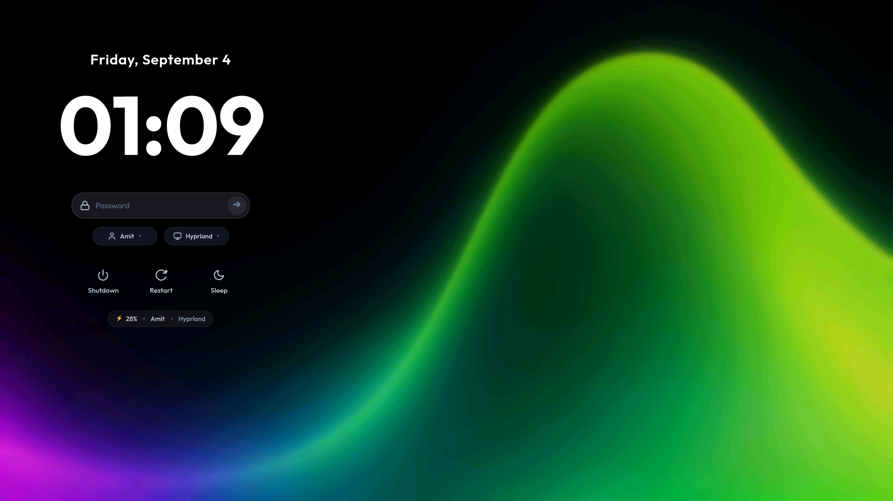
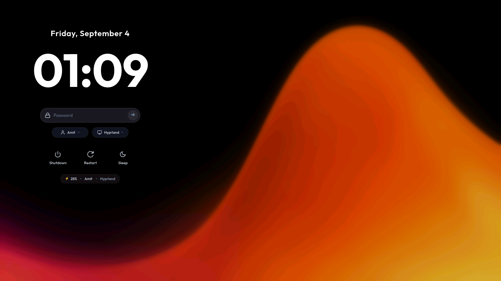
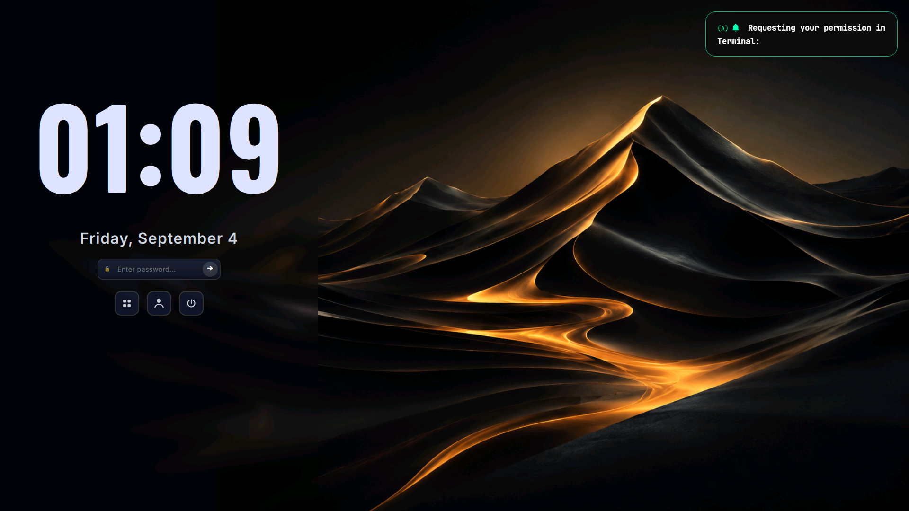
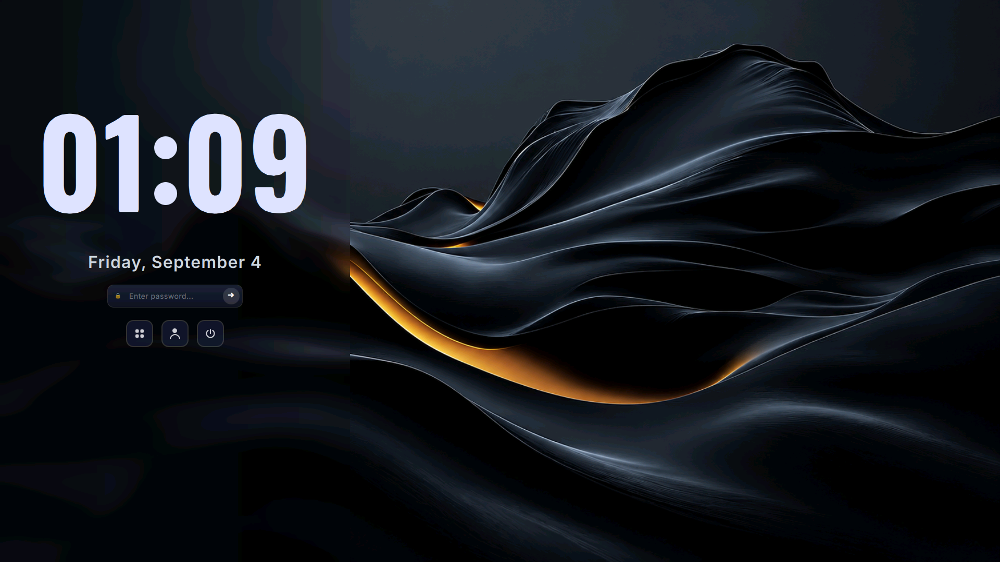
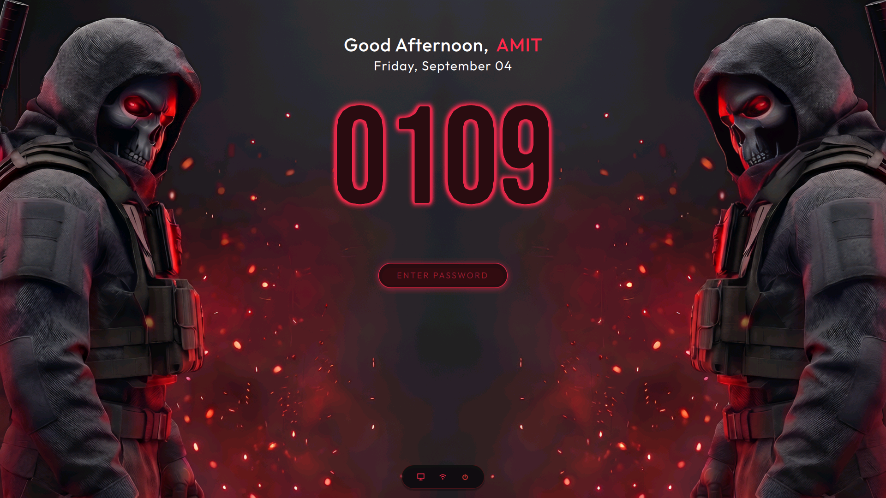
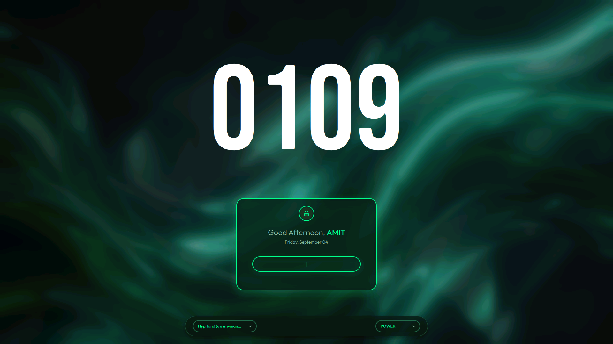

# SDDM Themes Collection

A collection of modern, beautiful, and highly polished SDDM login themes.

---

## 1. GreenShift

**GreenShift** is a sleek, modern glassmorphic SDDM greeter theme featuring vivid green glowing accents and high-contrast typography. It features custom fonts (*Outfit*, *Bebas Neue*, and *JetBrainsMono*), a live clock and date display, smooth input focus, error animations, session/user selection dropdowns, and dedicated power management controls.

[📥 Download ZIP](https://github.com/amitpadhan525/sddm-themes/releases/latest/download/GreenShift.zip) • `curl -sSLO https://github.com/amitpadhan525/sddm-themes/releases/latest/download/GreenShift.zip && unzip -q GreenShift.zip && cd GreenShift && ./setup.sh`

---

## 2. OrangeShift

**OrangeShift** is a vibrant, modern glassmorphic SDDM greeter theme accented with deep orange and amber tones. Built on Qt6 / QML, it showcases custom typography (*Outfit*, *Bebas Neue*, *JetBrainsMono*), live digital clock, session selector, error shake animations, and power controls.

[📥 Download ZIP](https://github.com/amitpadhan525/sddm-themes/releases/latest/download/OrangeShift.zip) • `curl -sSLO https://github.com/amitpadhan525/sddm-themes/releases/latest/download/OrangeShift.zip && unzip -q OrangeShift.zip && cd OrangeShift && ./setup.sh`

---

## 3. Golden Horizon

**Golden Horizon** is a warm, elegant SDDM login theme featuring golden sunset tones and high-contrast typography. It showcases a modern centered login card with smooth glassmorphism, bold digital clock display, dynamic greetings, and intuitive power/session selector controls.

[📥 Download ZIP](https://github.com/amitpadhan525/sddm-themes/releases/latest/download/golden-horizon.zip) • `curl -sSLO https://github.com/amitpadhan525/sddm-themes/releases/latest/download/golden-horizon.zip && unzip -q golden-horizon.zip && cd golden-horizon && ./setup.sh`

---

## 4. Midnight Current

**Midnight Current** is a sleek, deep dark blue SDDM login theme with vibrant electrical glowing accents. Designed for modern desktop setups, it includes a clean glassmorphic card layout, sharp digital clock typography, interactive session options, and power controls.

[📥 Download ZIP](https://github.com/amitpadhan525/sddm-themes/releases/latest/download/midnight-current.zip) • `curl -sSLO https://github.com/amitpadhan525/sddm-themes/releases/latest/download/midnight-current.zip && unzip -q midnight-current.zip && cd midnight-current && ./setup.sh`

---

## 5. Phantom Red

**Phantom Red** is a dark, tactical, gaming-inspired SDDM login theme. It features a symmetric layout with hooded skull soldiers with glowing red eyes, set against a dark smoky background with floating red embers. The UI highlights a glowing massive digital clock, dynamic user greetings, and a bottom control dock.

[📥 Download ZIP](https://github.com/amitpadhan525/sddm-themes/releases/latest/download/phantom-red.zip) • `curl -sSLO https://github.com/amitpadhan525/sddm-themes/releases/latest/download/phantom-red.zip && unzip -q phantom-red.zip && cd phantom-red && ./setup.sh`

---

## 6. Nebula

**Nebula** is a modern, futuristic, dark glassmorphic SDDM login theme inspired by Hyprlock. It features sleek neon accents, frosted glass effects, an elegant centered card layout, fluid micro-animations, and custom QML components.

[📥 Download ZIP](https://github.com/amitpadhan525/sddm-themes/releases/latest/download/nebula.zip) • `curl -sSLO https://github.com/amitpadhan525/sddm-themes/releases/latest/download/nebula.zip && unzip -q nebula.zip && cd nebula && ./setup.sh`

---

## ⚙️ Installation

For step-by-step instructions on how to install and activate any of these themes, please refer to the [Installation Guide](file:///home/amit/github/sddm-themes/installation.md).

---

## 📄 License

This repository is licensed under the [MIT License](LICENSE).
